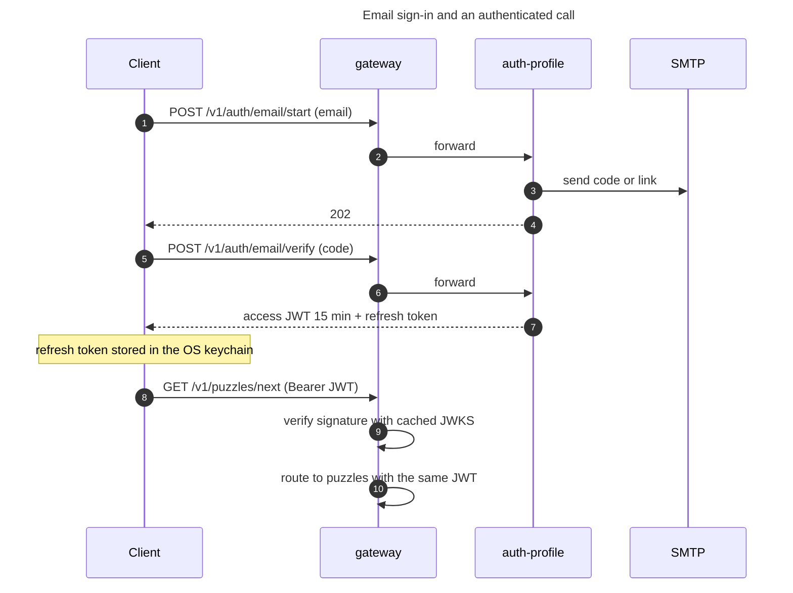
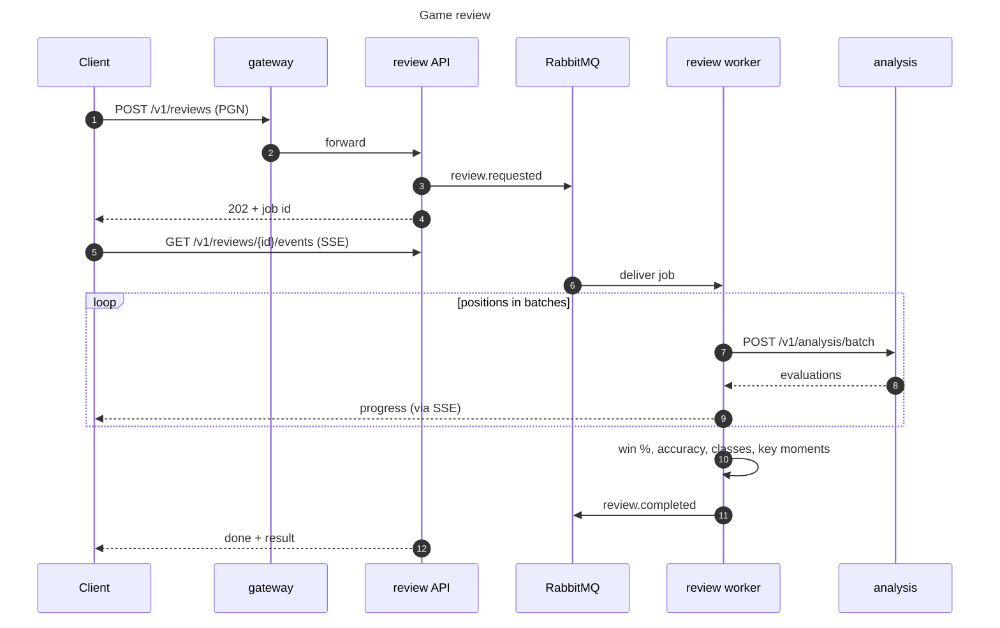
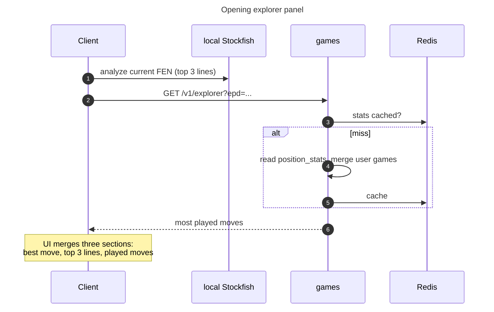
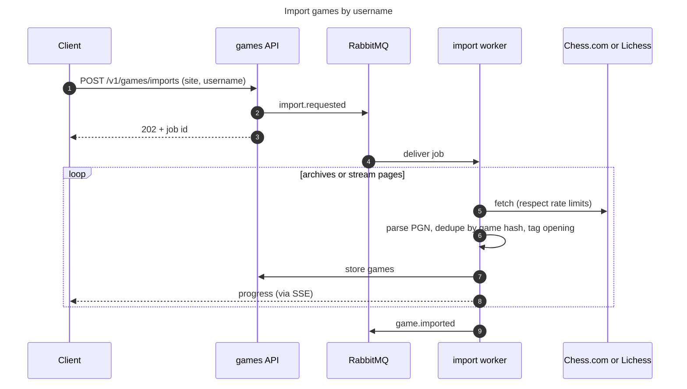
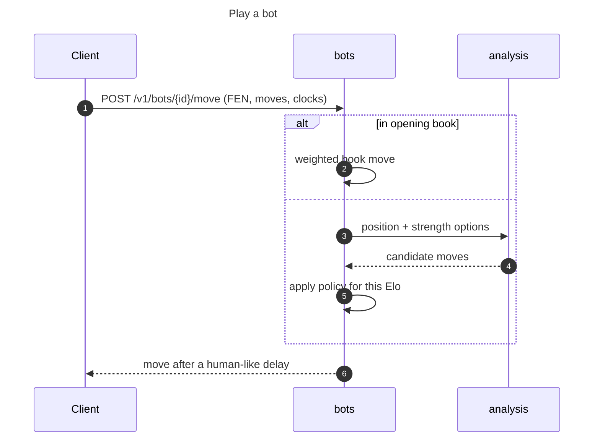

# Key flows (sequence diagrams)

The five flows that cross services. If an implementation disagrees with one of these, fix the code or update the diagram and the matching ADR.

```mermaid
sequenceDiagram
  autonumber
  title Email sign-in and an authenticated call
  participant C as Client
  participant G as gateway
  participant A as auth-profile
  participant M as SMTP
  C->>G: POST /v1/auth/email/start (email)
  G->>A: forward
  A->>M: send code or link
  A-->>C: 202
  C->>G: POST /v1/auth/email/verify (code)
  G->>A: forward
  A-->>C: access JWT 15 min + refresh token
  Note over C: refresh token stored in the OS keychain
  C->>G: GET /v1/puzzles/next (Bearer JWT)
  G->>G: verify signature with cached JWKS
  G->>G: route to puzzles with the same JWT
```

```mermaid
sequenceDiagram
  autonumber
  title Game review
  participant C as Client
  participant G as gateway
  participant R as review API
  participant Q as RabbitMQ
  participant W as review worker
  participant A as analysis
  C->>G: POST /v1/reviews (PGN)
  G->>R: forward
  R->>Q: review.requested
  R-->>C: 202 + job id
  C->>R: GET /v1/reviews/{id}/events (SSE)
  Q->>W: deliver job
  loop positions in batches
    W->>A: POST /v1/analysis/batch
    A-->>W: evaluations
    W-->>C: progress (via SSE)
  end
  W->>W: win %, accuracy, classes, key moments
  W->>Q: review.completed
  R-->>C: done + result
```

```mermaid
sequenceDiagram
  autonumber
  title Opening explorer panel
  participant C as Client
  participant E as local Stockfish
  participant G as games
  participant X as Redis
  C->>E: analyze current FEN (top 3 lines)
  C->>G: GET /v1/explorer?epd=...
  G->>X: stats cached?
  alt miss
    G->>G: read position_stats, merge user games
    G->>X: cache
  end
  G-->>C: most played moves
  Note over C: UI merges three sections:<br/>best move, top 3 lines, played moves
```

```mermaid
sequenceDiagram
  autonumber
  title Import games by username
  participant C as Client
  participant G as games API
  participant Q as RabbitMQ
  participant W as import worker
  participant X as Chess.com or Lichess
  C->>G: POST /v1/games/imports (site, username)
  G->>Q: import.requested
  G-->>C: 202 + job id
  Q->>W: deliver job
  loop archives or stream pages
    W->>X: fetch (respect rate limits)
    W->>W: parse PGN, dedupe by game hash, tag opening
    W->>G: store games
    W-->>C: progress (via SSE)
  end
  W->>Q: game.imported
```

```mermaid
sequenceDiagram
  autonumber
  title Play a bot
  participant C as Client
  participant B as bots
  participant A as analysis
  C->>B: POST /v1/bots/{id}/move (FEN, moves, clocks)
  alt in opening book
    B->>B: weighted book move
  else
    B->>A: position + strength options
    A-->>B: candidate moves
    B->>B: apply policy for this Elo
  end
  B-->>C: move after a human-like delay
```

